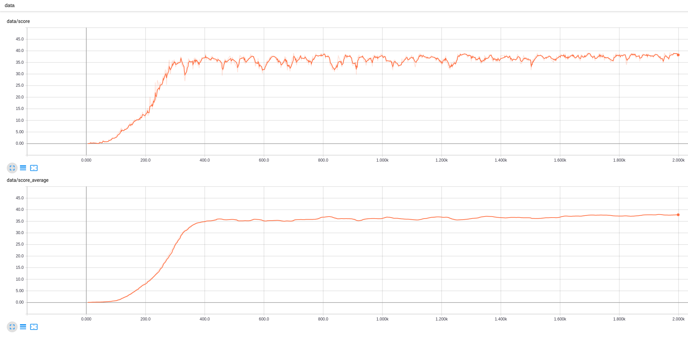
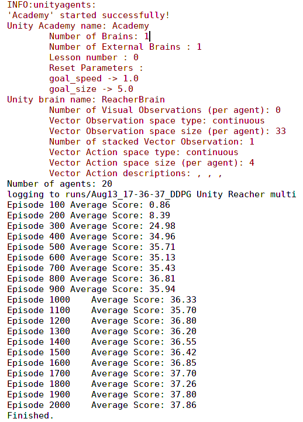

# Project 2: Continuous Control

The project consists of training an agent to control an arm to reach a goal position

The agent will navigate within the reacher Unity environment and has multiple degrees of freedom

A positive reward is given when the agent reach a moving goal, so the aim of the agent is to reach the goal and keep the goal within reach for as much time as possible

## Table of contents


## Getting Started

These instructions will help with setting up the project

### Prerequisites
Create a virtual environment with conda:
```
conda env create -f environment.yml
conda activate drl
```

This will take care of installing all the dependencies needed

### Installing

The following steps allows to setting up the project correctly

Say what the step will be

```
move the 'Reacher_Linux' folder inside 'environment/'
```

## Running the code

The project is divided in two sections: training & testing

### Training

To start training the agent run the following:

```
python Reacher-DDPG.py
```
The code will generate Tensorboard stats for visualisation. You can see them by running:
```tensorboard --logdir=runs``` from the ```drl_continuous_control``` folder

### Testing
The latest model from the agent will be saved in ```checkpoint.pth```.
Rename ```checkpoint.pth``` into ```model.pth``` 

To look at the agent in action run the following:

```
python replay_banana
```

## Results
Here is a video of the agent in action:

https://youtu.be/uQFR3ll6CqM

Here is a graph of the progression of the score from Tensorboard (up) and the average of the last 100 scores (down)

The agent successfully reaches an average of 30 points around episode 325

Here is the log from console:
